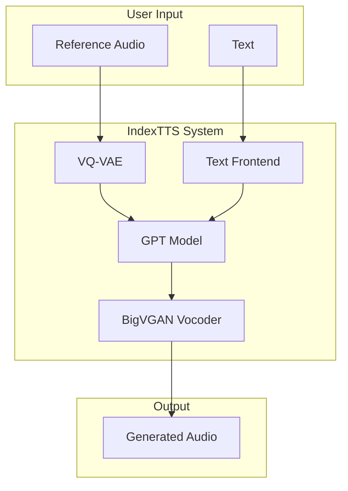
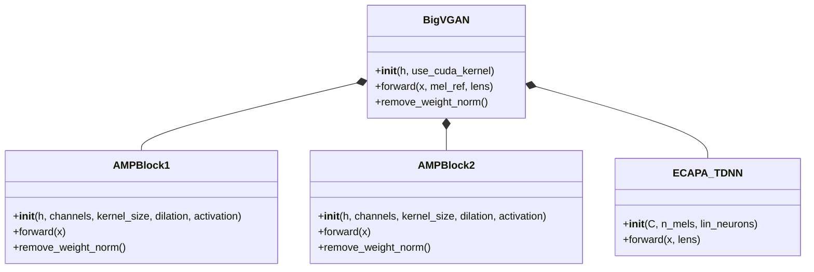
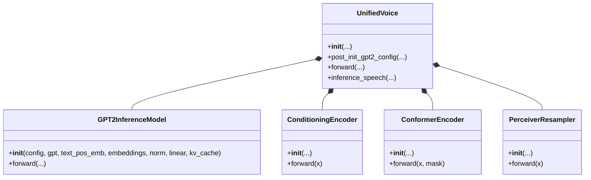
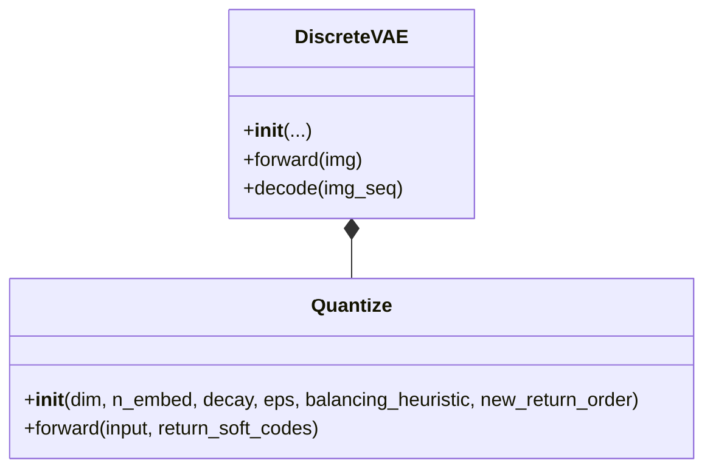

# IndexTTS Developer Guide

This document provides an in-depth explanation of the IndexTTS repository, intended for developers who will be working on the codebase. It covers the project's architecture, dependencies, quirks, and potential areas for refactoring or optimization.

## 1. Project Overview

IndexTTS is a GPT-style text-to-speech (TTS) model that is capable of generating high-quality speech in both English and Chinese. It is based on the XTTS and Tortoise models, and it includes several enhancements, such as:

*   **Chinese Pinyin Support:** The model can correct the pronunciation of Chinese characters using pinyin.
*   **Controllable Pauses:** The model can control pauses at any position through punctuation marks.
*   **BigVGAN2 Vocoder:** The model uses the BigVGAN2 vocoder to optimize audio quality.
*   **Conformer Conditioning Encoder:** The model uses a conformer conditioning encoder to improve training stability and voice timbre similarity.

## 2. Architecture

The IndexTTS system is composed of several key components:

*   **Text Frontend:** This component is responsible for processing the input text. It includes a `TextNormalizer` and a `TextTokenizer`.
*   **VQ-VAE:** This component is a Vector-Quantized Variational Autoencoder that is used to create a discrete representation of the mel spectrograms.
*   **GPT Model:** This is a GPT-2-based model that generates the speech from the text and a reference voice.
*   **BigVGAN Vocoder:** This is the vocoder that generates the final audio waveform from the model's output.

### 2.1. High-Level Component Diagram



### 2.2. BigVGAN Vocoder

The BigVGAN vocoder is a generative adversarial network (GAN) that is used to generate the final audio waveform. It is based on the BigVGAN architecture, and it includes several enhancements, such as:

*   **Anti-Aliased Activation Function:** The model uses an anti-aliased activation function to improve the quality of the generated audio. This is implemented in the `AMPBlock1` and `AMPBlock2` modules, which use a periodic activation function called "snake".
*   **Custom CUDA Kernel:** The model has a custom CUDA kernel for the activation function, which provides a significant speedup on CUDA-enabled GPUs.
*   **Speaker Encoder:** The model uses an ECAPA-TDNN speaker encoder to extract a speaker embedding from the reference mel spectrogram. This embedding is used to condition the generator.

#### Class Diagram



### 2.3. GPT Model

The GPT model is a GPT-2-based model that generates the speech from the text and a reference voice. It is based on the Hugging Face `transformers` library, and it includes several enhancements, such as:

*   **DeepSpeed Integration:** The model can be accelerated using DeepSpeed for inference.
*   **Conditioning Encoder:** The model uses a conditioning encoder to process the speech conditioning input. This can be a `PerceiverResampler` or a `ConformerEncoder`. The `PerceiverResampler` is used to reduce the dimensionality of the conditioning input, while the `ConformerEncoder` is used to extract features from the conditioning input.

#### Class Diagram



### 2.4. VQ-VAE

The VQ-VAE is a Vector-Quantized Variational Autoencoder that is used to create a discrete representation of the mel spectrograms. This is a common technique in speech synthesis models, as it can help to stabilize training and improve the quality of the generated audio.

#### Class Diagram



## 3. Dependencies

The IndexTTS model has several dependencies:

*   **PyTorch:** The model is built using PyTorch.
*   **Transformers:** The GPT model is based on the Hugging Face `transformers` library.
*   **DeepSpeed:** The model can be accelerated using DeepSpeed.
*   **CUDA Toolkit:** The custom CUDA kernel for the BigVGAN activation function requires the CUDA toolkit.
*   **C++ Compiler:** The custom CUDA kernel also requires a C++ compiler.

## 4. Quirks and Things to Be Wary Of

*   **Custom CUDA Kernel:** The BigVGAN component has a custom CUDA kernel for its activation function. This means that the model will be significantly faster on a GPU with CUDA support, but it also adds a dependency on the CUDA toolkit and a C++ compiler. If you're running on a machine without a CUDA-enabled GPU, the model will fall back to a slower PyTorch implementation.
*   **DeepSpeed Dependency:** The optional DeepSpeed integration adds another dependency. If you want to use DeepSpeed, you'll need to install it separately.
*   **Model Checkpoints:** The model requires several pre-trained checkpoint files to be downloaded. These are large files, so you'll need a good internet connection and enough disk space.
*   **"Fast" vs. "Slow" Inference:** The `infer.py` script has two inference methods: `infer` and `infer_fast`. The `infer_fast` method is significantly faster, but it might produce slightly different results. It's important to be aware of this and to choose the appropriate method for your needs.
*   **Text Processing:** The quality of the generated speech will depend on the quality of the text processing. The `TextNormalizer` and `TextTokenizer` are important components, and any issues with them could lead to mispronunciations or other artifacts in the output.
*   **Pinyin and Chinese Support:** The `README.md` mentions that the model has special support for Chinese, including the ability to correct pronunciation using pinyin. This is a key feature, but it also means that the model is more complex than a standard English-only TTS system.

## 5. Refactoring and Optimization

*   **CUDA Kernel:** The custom CUDA kernel for the BigVGAN activation function is a major optimization. If you are running on a machine with a CUDA-enabled GPU, this will provide a significant speedup.
*   **DeepSpeed:** The optional DeepSpeed integration is another major optimization. If you are working with a very large model, or if you want to do distributed training, DeepSpeed can be very helpful.
*   **"Fast" Inference:** The `infer_fast` method is a key optimization for long texts. It works by batching sentences and using a bucketing strategy. This can provide a significant speedup, but it might produce slightly different results than the standard `infer` method.
*   **Code Duplication:** There is some code duplication between the `infer` and `infer_fast` methods. It might be possible to refactor this code to reduce the duplication.
*   **Configuration:** The model is configured using a YAML file. This is a good practice, as it makes it easy to change the model's hyperparameters without modifying the code. However, it also means that you need to be careful to keep the configuration file in sync with the code.

## 6. Training

This section provides instructions on how to train the IndexTTS model.

### 6.1. Datasets

The IndexTTS model is trained on a combination of internal and external datasets. The external datasets include:

*   **AISHELL-3:** A large-scale Mandarin speech corpus.
*   **VTCK:** A multi-speaker English speech corpus.
*   **LibriTTS:** A large-scale English speech corpus.

### 6.2. Training Script

The training script is located in the `scripts` directory. To train the model, you will need to run the following command:

```bash
python scripts/train.py --config configs/config.yml
```

### 6.3. Configuration File

The configuration file is located in the `configs` directory. This file contains all the hyperparameters for the model, such as the learning rate, the batch size, and the number of training epochs. You will need to modify this file to suit your needs.
